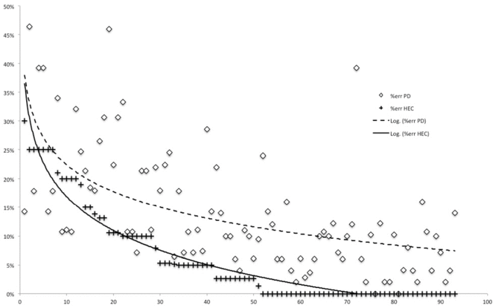

# Italian PD Dataset

## Overview
The Italian Parkinson's Voice and Speech Database consists of audio recordings from Italian speakers, including patients with Parkinson's disease and healthy controls. This comprehensive collection was designed to facilitate research in speech-based detection and monitoring of Parkinson's disease.

## Dataset Composition
- **Young Healthy Controls**: 15 individuals aged 19-29 years
- **Elderly Healthy Controls**: 22 individuals aged 60-77 years
- **Parkinson's Disease Patients**: 28 individuals aged 40-80 years

## Recording Types
Participants performed multiple speech tasks:
1. Two readings of a phonemically balanced text (with 30s pause)
2. Syllable pronunciations: 'pa' (5s), pause (20s), 'ta' (5s)
3. Sustained vowel phonations:
  - Two recordings of vowel 'a'
  - Two recordings of vowel 'e'
  - Two recordings of vowel 'i'
  - Two recordings of vowel 'o'
  - Two recordings of vowel 'u'
4. Reading of phonemically balanced words and phrases (with 1 min pause)

## Access
The dataset is publicly available at: [https://ieee-dataport.org/open-access/italian-parkinsons-voice-and-speech](https://ieee-dataport.org/open-access/italian-parkinsons-voice-and-speech)

## Citation

@data{aw6b-tg17-19,
  doi = {10.21227/aw6b-tg17},
  url = {https://dx.doi.org/10.21227/aw6b-tg17},
  author = {Dimauro, Giovanni and Girardi, Francesco},
  publisher = {IEEE Dataport},
  title = {Italian Parkinson's Voice and Speech},
  year = {2019}
}

@INPROCEEDINGS{7533761,
  author={Dimauro, Giovanni and Caivano, Danilo and Bevilacqua, Vitoantonio and Girardi, Francesco and Napoletano, Vito},
  booktitle={2016 IEEE International Symposium on Medical Measurements and Applications (MeMeA)}, 
  title={VoxTester, software for digital evaluation of speech changes in Parkinson disease}, 
  year={2016},
  volume={},
  number={},
  pages={1-6},
  doi={10.1109/MeMeA.2016.7533761}
}

@ARTICLE{8070308,
  author={Dimauro, Giovanni and Di Nicola, Vincenzo and Bevilacqua, Vitoantonio and Caivano, Danilo and Girardi, Francesco},
  journal={IEEE Access}, 
  title={Assessment of Speech Intelligibility in Parkinson’s Disease Using a Speech-To-Text System}, 
  year={2017},
  volume={5},
  number={},
  pages={22199-22208},
  doi={10.1109/ACCESS.2017.2762475}
}
